## Add templates to Excel, Word, and PowerPoint with Microsoft 365

In one of my recent business endeavors, an organization needed to add company-branded templates to the Microsoft Office suite (Microsoft 365 Apps). One of the requirements was to keep these templates in revision and easy for the branding team to add, delete or update if needed.

Luckily Microsoft added a feature back in 2019 to their Microsoft 365 portfolio allowing just that. In this article, we are going to explore how we can configure the feature in just a few minutes.


## Table of contents

[TOC]

## Video

If you rather watch a video that covers the same topic.

[Video]


## Requirements

Before we can proceed, please read the requirements:

- If the templates need to appear to users user in *PowerPoint on the web*, then the user must be assigned a license to Office 365 E3 or E5
- Microsoft Office (Microsoft 365 Apps) version 2002 or higher
- Office templates in the following file formats *[.xltx](https://support.microsoft.com/office/save-a-workbook-as-a-template-58c6625a-2c0b-4446-9689-ad8baec39e1e)*, *[.dotx](https://support.microsoft.com/topic/create-a-template-86a1d089-5ae2-4d53-9042-1191bce57deb)* or *[.potx](https://support.microsoft.com/office/ee4429ad-2a74-4100-82f7-50f8169c8aca)*
- You as an admin must have the permission of *SharePoint admin* or *Global administrator* in Azure AD
- You as an admin must have access (owner/full control) to a SharePoint site using a *communication site*, *team site,* or a *modern team site* template where the templates will be stored
- Know the Azure AD tenant id, for more information [see this guide](https://docs.microsoft.com/en-us/azure/active-directory/fundamentals/active-directory-how-to-find-tenant)


## Goal and technology

As I mentioned at the start the end goal is to achieve that Microsoft Office automatically pulls templates from Microsoft 365 without any application packages (Intune/Endpoint Manager/SCCM) and policies. Here is a visual overview of the solution:

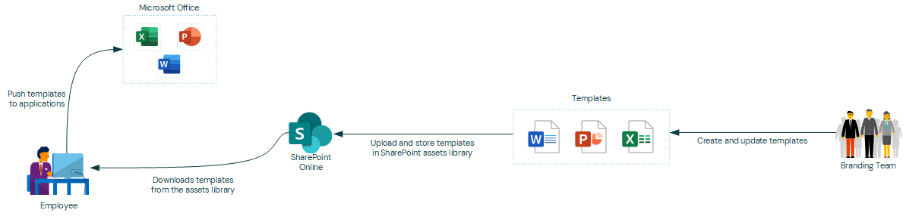

The solution is going to leverage a feature (built-in SharePoint app) in SharePoint Online called "**Asset Library**". SharePoint's built-in Asset Library app is pre-configured to manage rich media assets, such as images, audio, video, and template files.

SharePoint leverages the Office 365 CDN (Content Delivery Network) capabilities. A CDN is a mechanism that aims to improve considerably websites performances by providing assets the website requires (such as scripts or images) closer to the browsers requesting it.


## Installation and configuration

Let's start configuring the asset library for our templates, before following this tutorial, please make sure that the requirements are fulfilled.


### Installing the SharePoint Online PowerShell module

We are going to use the SharePoint Online PowerShell module for some parts of the configuration. If you haven't installed this, please make sure to follow the steps below.

1. Open a PowerShell terminal and run the following:

   ```powershell
   Install-Module -Name Microsoft.Online.SharePoint.PowerShell -Scope CurrentUser -Confirm:$false -Force;
   ```

   > IMPORTANT: If you are prompted to update [PowerShellGet](https://github.com/PowerShell/PowerShellGet), please do so.

2. Now let's connect to the SharePoint Online administration site.

   ```powershell
   Connect-SPOService -Url "https://<tenant_name>-admin.sharepoint.com";
   ```

   > IMPORTANT: Replace <tenant_name> with your Microsoft 365 tenant name in the above example.

3. In the (modern) authentication prompt add your admin username and password.

   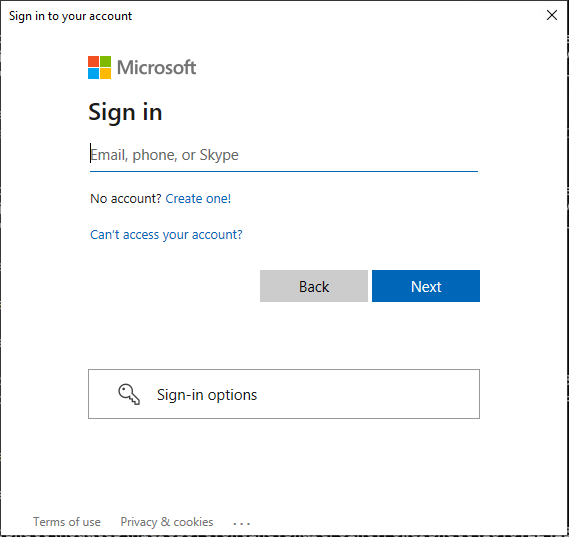

4. Verify that you are connected by running the following command.

   ```powershell
   Get-SPOTenant;
   ```

5. You should get a similar output as shown below.

   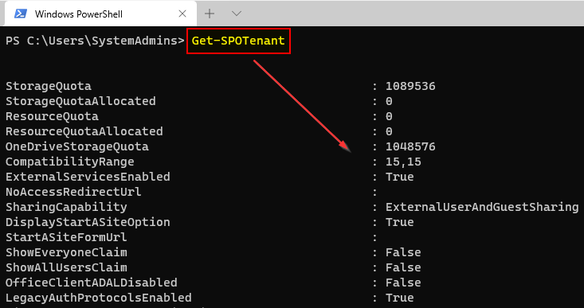


### Adding the appropriate permissions to the SharePoint Online site

When the Microsoft Office application(s) fetches the templates from SharePoint it will do so in a user context. Because of that, we need to make sure that the users can read the assets on the SharePoint site. In this example, we will be using the built-in SharePoint Online group "everyone except external users".

Please make sure that you are connected to SharePoint through PowerShell shown in the above section.

1. Open a PowerShell terminal and executed the following.

   ```powershell
   # Variables.
   $AzureAdTenantId = '<Azure AD Tenant ID>';
   $SharePointSiteUrl = 'https://<tenant>.sharepoint.com/<sites/teams>/<site>';
   
   # Get all groups in the SharePoint site.
   $SpoGroupVisitor = Get-SPOSiteGroup -Site $SharePointSiteUrl | Where-Object {$_.LoginName -like "*Visitors*"};
   
   # Add the "everyone, except external" group to the visitor group.
   Add-SPOUser -Site $SharePointSiteUrl -LoginName ('c:0-.f|rolemanager|spo-grid-all-users/{0}' -f $AzureAdTenantId) -Group $SpoGroupVisitor.LoginName;
   ```

   > IMPORTANT: Remember to change the [Azure AD tenant ID](https://docs.microsoft.com/en-us/azure/active-directory/fundamentals/active-directory-how-to-find-tenant) and SharePoint site URL in the above example.


### Creating a library in the SharePoint Online site

Before we can add the asset library, we need to create it. The following will create a normal document library, which we will "convert" in the next section. We are <u>not</u> going to use PowerShell here for demonstration purposes. But if you are interested to create the document library with PowerShell you could use the [New-PnPList](https://pnp.github.io/powershell/cmdlets/New-PnPList.html) from the [PnP PowerShell SharePoint module](https://pnp.github.io/powershell/index.html).

1. Open a browser and navigate to "**https://<tenant>.sharepoint.com/<sites or teams>/<site>/_layouts/15/viewlsts.aspx**".

   > IMPORTANT: Remember to change the SharePoint site URL.

2. Click "**New**" and then "**Document Library**".

   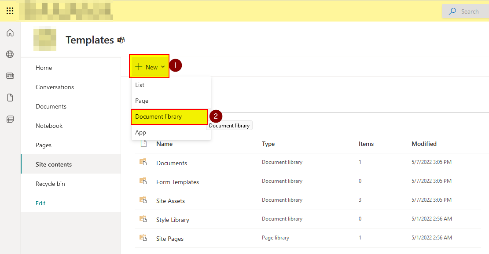

3. Specify the new library name and then click "**Create**".

   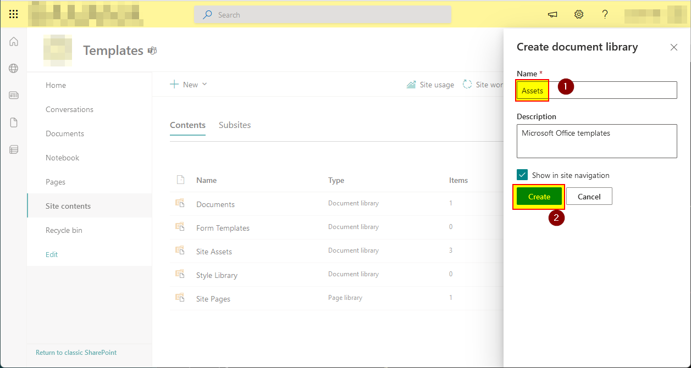

4. Now copy the path to the document library (without the /Forms/AllItems.aspx), we are going to use it later.

   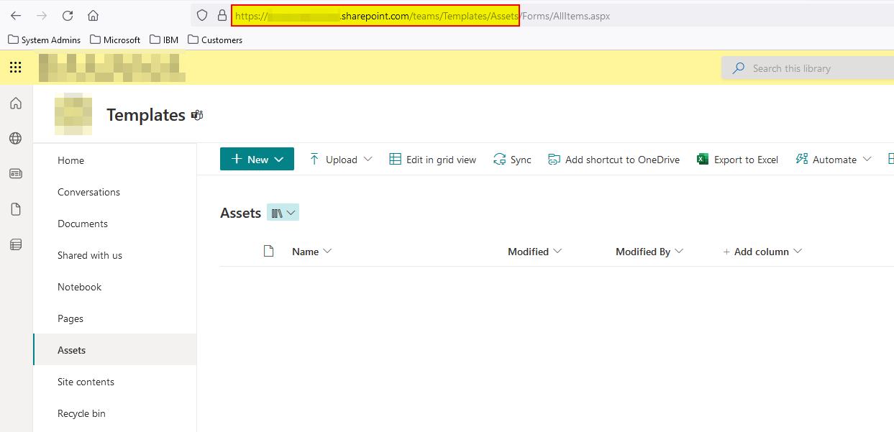


### Convert document library to an asset library

In the previous section, we created a document library on the SharePoint Online site. Now we need to convert it to an asset library.

1. Open a PowerShell terminal and run the following.

   ```powershell
   # Variables.
   $SharePointSiteLibraryUrl = 'https://<tenant>.sharepoint.com/<sites or teams>/<site>/<document library>';
   
   # Add the asset library.
   Add-SPOOrgAssetsLibrary -LibraryUrl $SharePointSiteLibraryUrl -OrgAssetType OfficeTemplateLibrary -CdnType Private -Confirm:$false;
   ```

   > IMPORTANT: Remember to change the library URL in the above example. Adding an organization assets library will enable a content delivery network (CDN) for your organization to provide fast and reliable performance for shared assets. You'll be prompted to enable a CDN for each organization asset library you add.


### Uploading the templates to the document library

Now the hard part is over, now we need to upload the Microsoft Office templates to the asset library.

1. Open a browser and navigate to "**https://<tenant>.sharepoint.com/<sites or teams>/<site>/<document library>**".

   > IMPORTANT: Remember to change the SharePoint site URL.

2. Click on "**Upload**" and then "**Files**".

   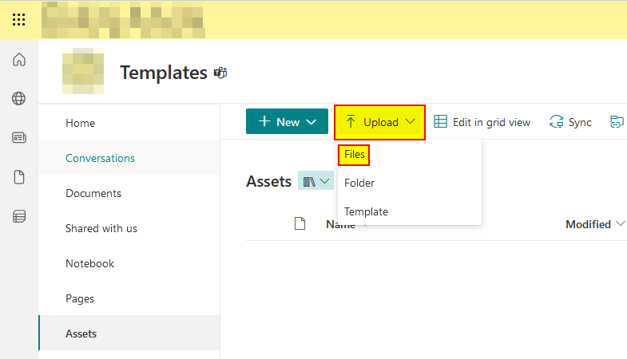

3. Now browse to the location with your *[.xltx](https://support.microsoft.com/office/save-a-workbook-as-a-template-58c6625a-2c0b-4446-9689-ad8baec39e1e)*, *[.dotx](https://support.microsoft.com/topic/create-a-template-86a1d089-5ae2-4d53-9042-1191bce57deb)*, or *[.potx](https://support.microsoft.com/office/ee4429ad-2a74-4100-82f7-50f8169c8aca)* Microsoft Office templates and upload them.

   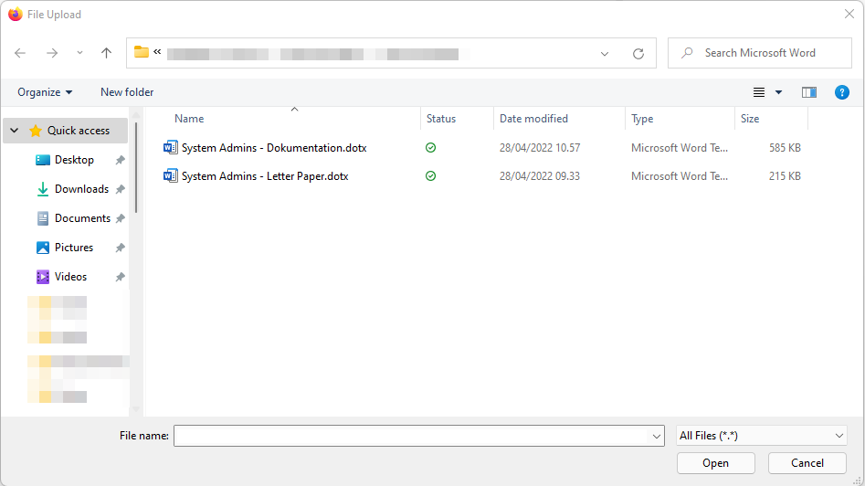

4. When the file is uploaded it will appear in the library.

   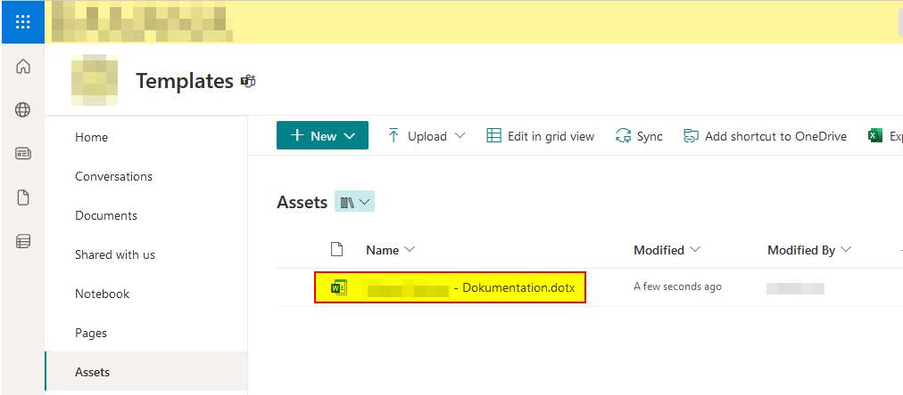


## The results

When all the configuration is done, it's now time to view the results of the "hard" labor. Please notice it may take <u>up to 24 hours</u> before the templates are visible in the Microsoft Office applications (Excel, Word, and PowerPoint).

1. Open one of the applications, in this example, we are using Microsoft Word.

2. Now click on "**New**".

   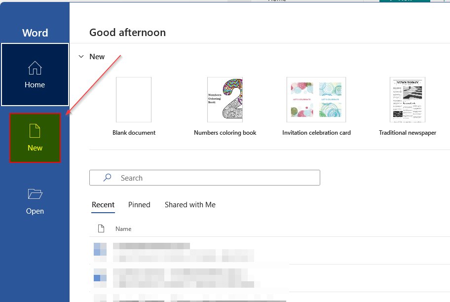

3. Click on your organization name (in this case *System Admins*).

   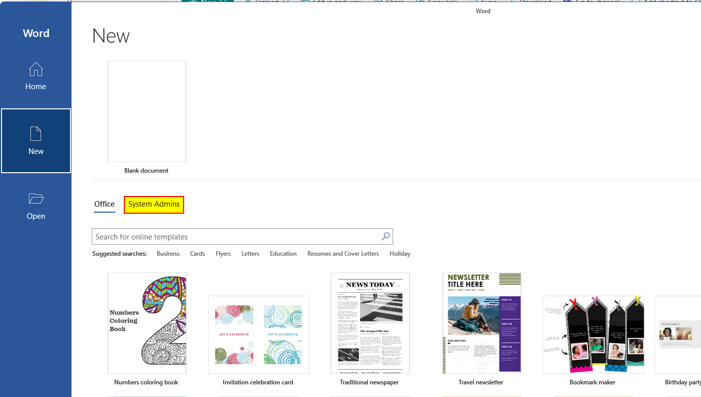

4. It also supports a hierarchy structure, meaning that you can organize the templates into folders. The templates you uploaded in the previous section are now visible.

   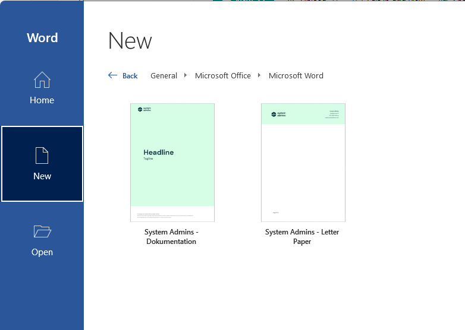


## Wrapping it up

That's it! Pretty easy right?

One thing to mention is that it could take <u>up to 24 hours before changes are propagated</u> on devices. This is because it's using the CDN which only updates the cache a few times a day. So be patient.

If you have any problems or issues, please make sure to leave a comment.


## Abbreviations

| Abbreviation | Meaning                   |
| ------------ | ------------------------- |
| App          | Application               |
| CDN          | Content Delivery Network  |
| URL          | Uniform Ressource Locator |


