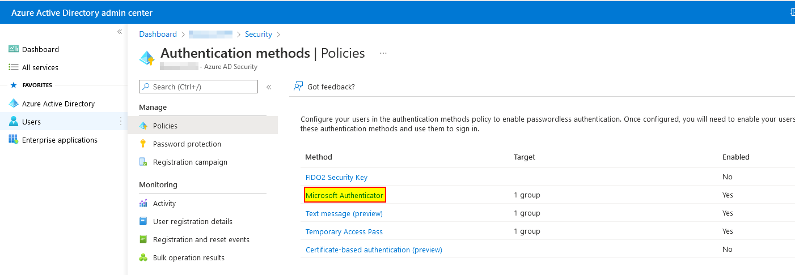
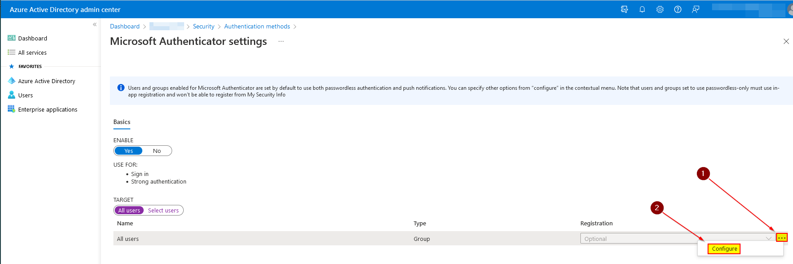
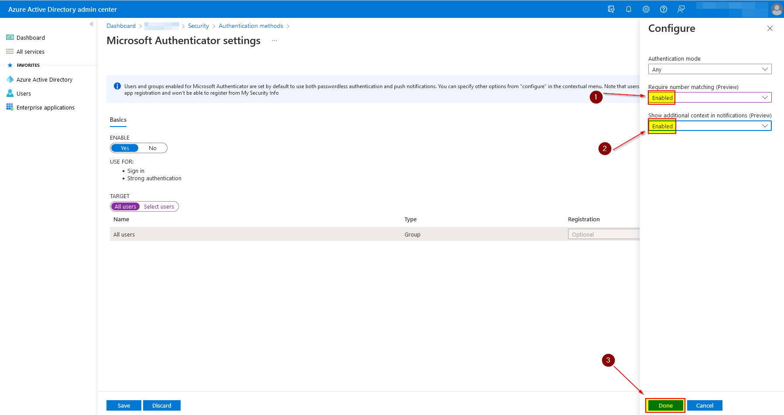
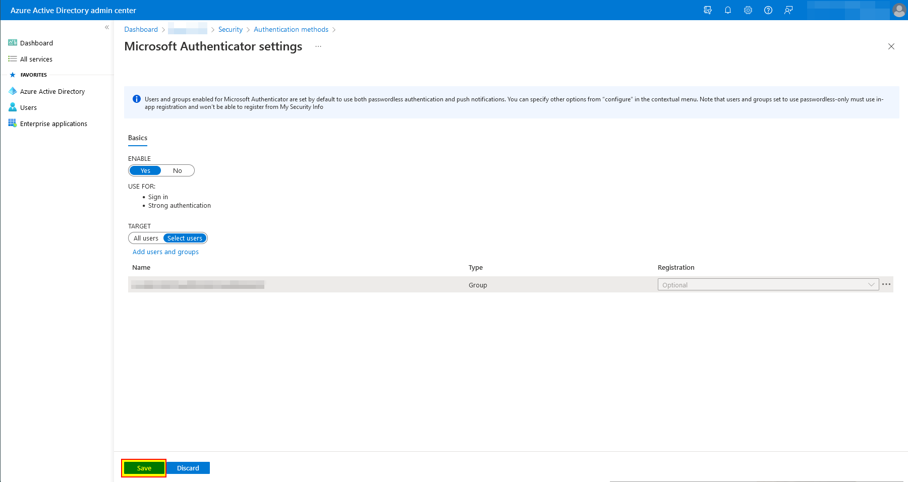

# Improve MFA with additional features using Microsoft Authenticator

This article covers enhancing user sign-in MFA using the number matching (preview), and location (preview) features in Microsoft 365 with Microsoft Authenticator.

Multi-factor authentication (MFA) is a process in which a user is prompted for additional forms of identification during a sign-in event. For example, the prompt could be to enter a cell phone code or provide a fingerprint scan. When you require a second form of identification, security is increased because this additional factor isn't easy for an attacker to obtain or duplicate.

[Number matching](https://docs.microsoft.com/en-us/azure/active-directory/authentication/how-to-mfa-number-match) and [location](https://docs.microsoft.com/en-us/azure/active-directory/authentication/how-to-mfa-additional-context) is a security upgrade from the traditional approach using approve/decline (challenges) notification requests. When both features are general availability (GA), it will be set as default, so it's recommended to enable number and location matching in the near term for improved sign-in security.

Before configuring the number matching and the location feature, it's essential to understand why Microsoft is pushing this as the new default MFA sign-in challenge.

During an average day, we, as users, get dozens of MFA challenges. Usually, we would just hit the approve button without really thinking about if the challenge was initiated by oneself or someone with malicious intent. To counteract this, it's now best practice in the security world to make the user respond to the MFA challenge with some matching sequence between the instigator and the approver.

## Prerequisites

- Microsoft Authenticator is enabled and installed on the users' mobile devices.
- Azure AD Free license (out-of-the-box in Microsoft 365).
- You have the *Global administrator* or *Authentication Policy Administrator* role in Azure AD.
- You must have access to the admin portal in Microsoft 365 / Azure with your user.

### Configuration

1. Open a browser and navigate to "**https://aad.portal.azure.com/#blade/Microsoft_AAD_IAM/AuthenticationMethodsMenuBlade/AdminAuthMethods**". This page is located under "**Azure AD**", "Security" and "**Authentication Methods**" in the Azure Portal.

2. Now click on "**Microsoft Authenticator**" in the policy overview.

   

3. Now on the target (All users or a group), click on the three dots ("**...**") and select "**Configure**".

   

   > IMPORTANT: Make sure that you test with a pilot of users before enabling it for all users in the organization.

4. Now on "**Require number matching**" and "**Show additional context in notifications**" select "**Enabled**" and click on "**Done**".

   

5. Now save the settings by clicking on "**Save**".

   

6. That's it! It will take effect right away.

## Abbreviations

| Abbreviation | Meaning                     |
| ------------ | --------------------------- |
| MFA          | Multi-Factor Authentication |
| AD           | Active Directory            |
| GA           | General Availability        |
