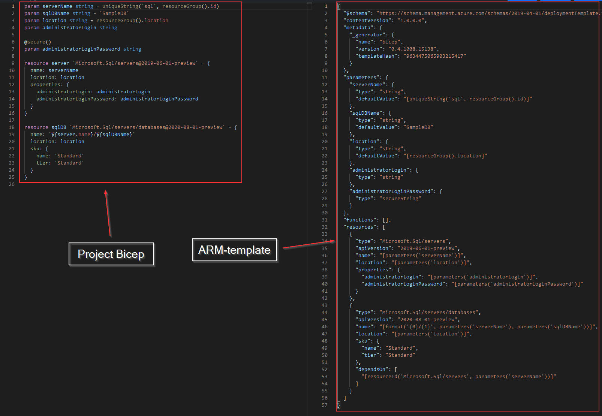
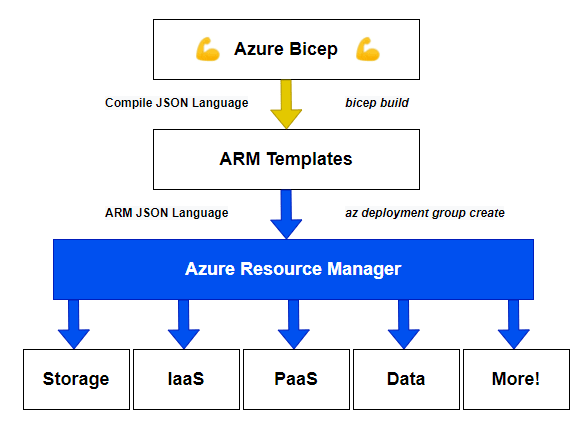
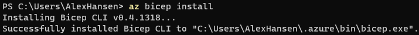
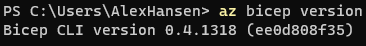
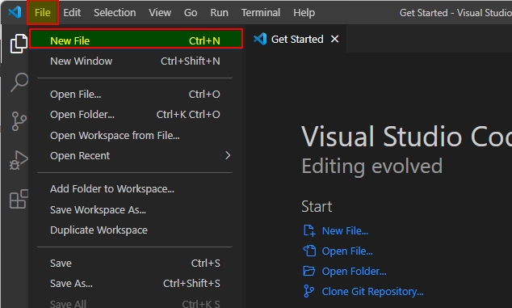
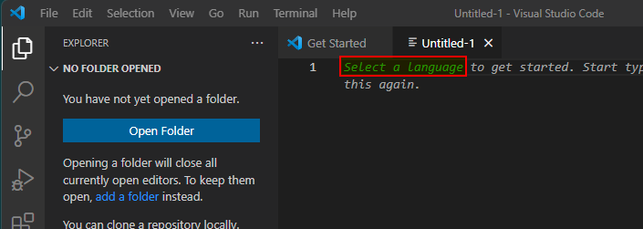
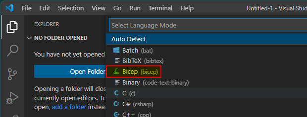
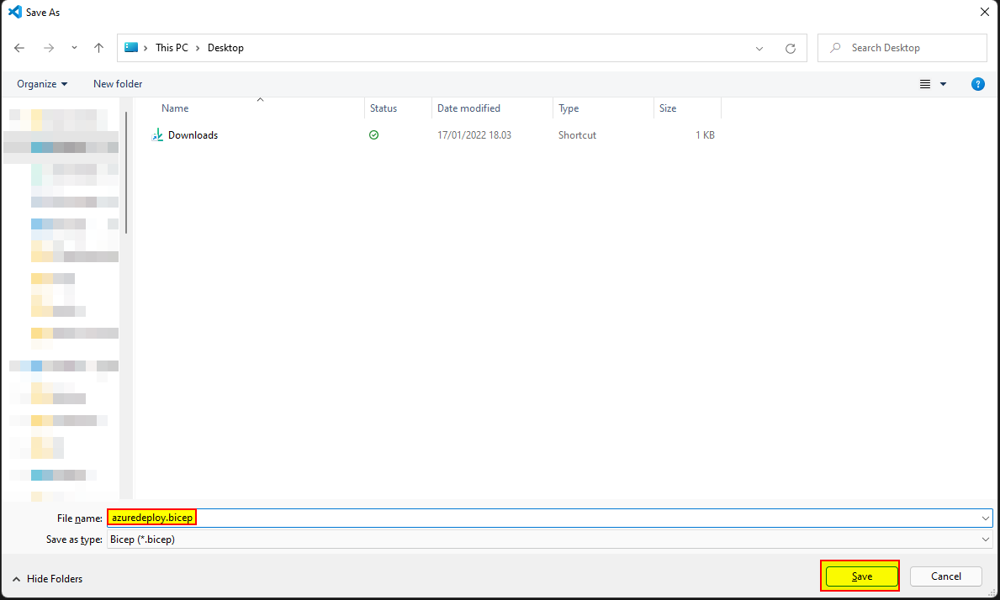
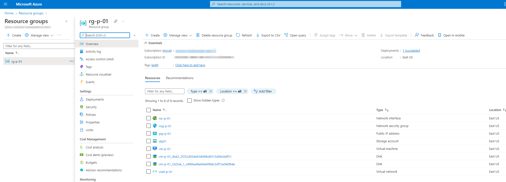

## What is Microsoft Bicep?

Microsoft has been developing and building a "new" domain-specific language (DSL) for deploying resources in Azure. In other words, Microsoft Bicep is a new Infrastructure-as-Code (IaC) language for deploying, deleting, updating, and keeping the infrastructure in source control using nothing but code.

We will take a look at what Microsoft Bicep is, why use it, and a hands-on lab guide. Let's get going!


## Table of contents

[TOC]

## Video

If you rather watch a video that covers the same topic.

[Video]


## Introduction to project Bicep

Before tools such as [project Bicep](https://github.com/Azure/bicep/), [Terraform](https://www.terraform.io/) and [Pulumi](https://www.pulumi.com/) you needed to use Azure Resource Manager (ARM) templates, if you wanted to programmatically deploy infrastructure resources to Microsoft Azure. ARM is a Microsoft deployment and management service which can be used for creating, updating, and deleting resources for Azure.

So why create a new tool (Bicep) to deploy Azure resources when we already have ARM?

Well, ARM templates can be very complex and hard to manage. The screenshot below is a comparison between Bicep (left) and an ARM template (right).



The code examples in the screenshot above deploy the same SQL server resource. The <u>ARM template is 57 lines</u> whereas <u>Bicep is only 25 lines</u>. But it's not only the shorter code, it's also the syntax which is much easier to read and maintain (in my opinion).

The Bicep language is kept in a file with the extension ".bicep", which makes it more readable and generally easier to compose. This way we can get away with stuffing all the code in JSON files, which is where the ARM templates live.

When the Bicep resource(s) is ready for deployment to Microsoft Azure, the *.bicep* file(s) get converted into an ARM template and then pushed to ARM. This means the Bicep is just a transport abstraction of ARM templates, which reduces the complexity and makes it more maintainable. The screenshot below visualizes the flow used in project Bicep.




## Terraform vs. Bicep

You may be thinking about why you should switch from Terraform to project Bicep?

I have been using Terraform for a few years and it works great (hands-down). The provider for Azure in Terraform is awesome, but unfortunately, it's [always a few features behind the release cycle of Microsoft Azure](https://github.com/hashicorp/terraform-provider-azurerm/issues). This is because Terraform is built by a third-party vendor (HashiCorp), whereas Bicep (built by Microsoft) is just a transport abstraction and will follow the newest features and products as soon they are released.

> "[Day 0 resource provider support. Any Azure resource — whether in private or public preview or GA — can be provisioned using Bicep](https://github.com/Azure/bicep#faq)"

If you are used to Terraform, you will properly know that it uses a (local) state file to keep track of the resources deployed. Bicep does NOT work the same way, there is no state file to keep. In Bicep, there are two modes which are called "*Complete*" and "*Incremental*" where the latter is the default.

In complete mode, Bicep **deletes** resources that exist in the resource group but aren't specified in the template.

In incremental mode, the Resource Manager **leaves unchanged** resources that exist in the resource group but aren't specified in the template. Resources in the template **are added** to the resource group.

So no state file nightmare like Terraform, but it does come with other problems. Microsoft informs that there is no need to switch from Terraform (just yet).

> "[If you're happy using Terraform, there's no reason to switch. Microsoft is committed to making sure Terraform on Azure is the best it can be](https://docs.microsoft.com/en-us/azure/azure-resource-manager/bicep/frequently-asked-questions#why-not-focus-your-energy-on-terraform-or-other-third-party-infrastructure-as-code-offerings)"

I recommend you try Bicep, even if you currently are using Terraform or another IaC tool. Knowledge is key, right? Just follow along for the ride.


## Getting started

We will create a virtual machine with Microsoft Bicep and the dependencies such as network, storage, and so on. Before diving into the actual test of Microsoft Bicep, there are some requirements you need to check before following along in this guide.

### Requirements

- [ ] <u>[Azure subscription](https://azure.microsoft.com/en-us/free/)</u> for deploying the resources
- [ ] <u>[Azure CLI](https://aka.ms/installazurecliwindows)</u> 2.20.0 or later installed. It's also possible with the [Azure Az PowerShell module](https://docs.microsoft.com/en-us/powershell/azure/install-az-ps). But here we will use Azure CLI.
- [ ] [Visual Studio Code](https://code.visualstudio.com/) for composing the .bicep file(s)
- [ ] [Bicep extension for Visual Studio Code](https://marketplace.visualstudio.com/items?itemName=ms-azuretools.vscode-bicep)


### Install Microsoft Bicep

Let's start installing the Microsoft Bicep utility.

1. Open a Windows Terminal (or command prompt/PowerShell terminal) and run the following command.

   ```powershell
   az bicep install
   ```

   

2. To check the version run the following command.

   ```powershell
   az bicep version
   ```

   


> Azure CLI installs a self-contained instance of the Bicep CLI. This instance doesn't conflict with any versions you may have manually installed. Azure CLI doesn't add Bicep CLI to your PATH.


### Create a Bicep file using Visual Studio Code

This section will create a Bicep file through Visual Studio Code, which will contain our code to create our Azure resources and establish our virtual machine.

1. Open "**Visual Studio Code**" on your computer.

2. Click on "**File**" and then "**New File**".

   

3. Click "**Select a language**".

   

4. Choose "**Bicep**" in the list.

   

5. Now save the file by pressing "**Ctrl**" + "**S**" on the keyboard (remember the path). I named my file "**azuredeploy.bicep**", but you can name it whatever you like.

   


You have now created a Bicep file, next, we are going to add some code.


### Adding the code to the Bicep file

I will split up the code into sections to make it easier to read and understand. We will keep the code as simple as possible for demonstration purposes. You can get the [full source code here](src/azuredeploy.bicep).

Because the language is considered declarative it's not important how you structure the file. Meaning that you can place the variables, parameters, or resources at the bottom, top or middle. But I like to structure the file like this:

1. Parameters
2. Variables
3. Resources/Modules
4. Output (we will not cover this)


#### Parameters

Parameters are used during deployment. In a Bicep template, you declare a parameter by using the `param` keyword. Parameters aka. declarations can be used anywhere in the Bicep file. 

The syntax of a parameter is:

```
param <parameterName> <parameterType>
```

In the file you created in an earlier step, add the following code.

```
// This is the parameter section.
param location string = resourceGroup().location
```

The above code tells Bicep that it needs to pull the resource group at the deployment operation. The parameter becomes a variable (read next section) and will contain the location of the resource group we deployed (more on that later on).


#### Variables

Variables are placeholders to be used in objects and make the code less repetitive. The resource manager resolves the variables (wherever the variable is used, it gets replaced in the code) before starting the deployment operations. I usually place the variables at the beginning of a Bicep file.

The syntax of declaring a variable is:

```
var <variable-name> = <variable-value>
```

The supported types are:

- array
- bool
- int
- object
- secureObject
- secureString
- string


In the file you created in an earlier step, add the following code.

```
// This is the variable section.
var adminUsername = 'systemadmin'
var adminPassword = 'MySuperSecretPassword123!'
var publicIpName = 'pip-p-01'
var publicIpAllocation = 'Dynamic'
var publicIpSku = 'Basic'
var publicIpDomainNameLabel = toLower('${vmName}-${uniqueString(resourceGroup().id, vmName)}')
var vmOsVersion = '2019-datacenter-gensecond'
var vmSize = 'Standard_D2s_v3'
var vmName = 'vm-p-01'
var vmNic = 'nic-p-01'
var vnet = 'vnet-p-01'
var vnetSubnet = 'snet-p-01'
var vnetSpace = '10.0.0.0/16'
var vnetSubnetPrefix = '10.0.0.0/24'
var nsg = 'nsg-p-01'
var storageAccount = 'stp01'
var storageAccountSku = 'Standard_LRS'
```

In the variable `publicIpDomainNameLabel,` we make use of built-in functions in Bicep.

- The first function `toLower()` take the text and makes it lowercase. In this case, it will become "vm-p-01-*randomhere*.eastus.cloudapp.azure.com"
- The second function `uniqueString()` creates a deterministic hash string of the values in this case the resource group id and the VM name.

I will not cover all the built-in functions in this article, but for more information [click this link](https://docs.microsoft.com/en-us/azure/azure-resource-manager/bicep/bicep-functions).

Also notice that you don't specify a data type for the variable. The type is inferred from the value.

It's also possible to add the variables to a separate file, this is useful if the code is the same, but let's say you have multiple environments (test, pre-prod, and production) where the resource names should be different. See [this link](https://docs.microsoft.com/en-us/azure/azure-resource-manager/bicep/patterns-shared-variable-file) for more information. But we will keep things simple.


#### Storage Account

([Microsoft.Storage/storageAccounts](https://docs.microsoft.com/en-us/azure/templates/Microsoft.Storage/storageAccounts))

The following section will add the storage account to store the VM boot diagnostic.

```
// Creates the storage acccount.
resource stg 'Microsoft.Storage/storageAccounts@2021-04-01' = {
  name: storageAccount
  location: location
  sku: {
    name: storageAccountSku
  }
  kind: 'Storage'
}
```

Using the parameters and variables created earlier it will replace the values.


#### Public IP

([Microsoft.Network/publicIPAddresses](https://docs.microsoft.com/en-us/azure/templates/Microsoft.Network/publicIPAddresses))

The following section will add the public IP for the virtual machine. This will be used for RDP connection to the VM.

```
// Creates the public ip.
resource pip 'Microsoft.Network/publicIPAddresses@2021-02-01' = {
  name: publicIpName
  location: location
  sku: {
    name: publicIpSku
  }
  properties: {
    publicIPAllocationMethod: publicIpAllocation
    dnsSettings: {
      domainNameLabel: publicIpDomainNameLabel
    }
  }
}
```

Using the parameters and variables created earlier it will replace the values.


#### Network Security Group (NSG)

([Microsoft.Network/networkSecurityGroups](https://docs.microsoft.com/en-us/azure/templates/Microsoft.Network/networkSecurityGroups))

The following section will add the network security group for the network interface card (NIC).

```
// Creates the network security group (NSG).
resource securityGroup 'Microsoft.Network/networkSecurityGroups@2021-02-01' = {
  name: nsg
  location: location
  properties: {
    securityRules: [
      // Allow inbound RDP.
      {
        name: 'inbound-allow-3389'
        properties: {
          priority: 1000
          access: 'Allow'
          direction: 'Inbound'
          destinationPortRange: '3389'
          protocol: 'Tcp'
          sourcePortRange: '*'
          sourceAddressPrefix: '*'
          destinationAddressPrefix: '*'
        }
      }
    ]
  }
}
```

Using the parameters and variables created earlier will replace the values. It will add a rule which allows TCP/3389 traffic inbound, to RDP the server through the public IP address.


#### Virtual Network (VNet)

([Microsoft.Network/virtualNetworks](https://docs.microsoft.com/en-us/azure/templates/Microsoft.Network/virtualNetworks))

The following section will add the VNet and subnet where the VM will be placed.

```
// Creates the virtual network (VNet).
resource vn 'Microsoft.Network/virtualNetworks@2021-02-01' = {
  name: vnet
  location: location
  properties: {
    addressSpace: {
      addressPrefixes: [
        vnetSpace
      ]
    }
    subnets: [
      {
        name: vnetSubnet
        properties: {
          addressPrefix: vnetSubnetPrefix
          networkSecurityGroup: {
            id: securityGroup.id
          }
        }
      }
    ]
  }
}
```

Using the parameters and variables created earlier it will replace the values.


#### Network Interface Card (NIC)

([Microsoft.Network/networkInterfaces](https://docs.microsoft.com/en-us/azure/templates/Microsoft.Network/networkInterfaces))

The following section will add the NIC for the VM. It will get an dynamic IP from the Azure DHCP server.

```
// Creates the network interface card (NIC).
resource nic 'Microsoft.Network/networkInterfaces@2021-02-01' = {
  name: vmNic
  location: location
  properties: {
    ipConfigurations: [
      {
        name: 'ipconfig1'
        properties: {
          privateIPAllocationMethod: 'Dynamic'
          publicIPAddress: {
            id: pip.id
          }
          subnet: {
            id: resourceId('Microsoft.Network/virtualNetworks/subnets', vn.name, vnetSubnet)
          }
        }
      }
    ]
  }
}
```

Using the parameters and variables created earlier it will replace the values.


#### Virtual Machine (VM)

([Microsoft.Compute/virtualMachines](https://docs.microsoft.com/en-us/azure/templates/Microsoft.Compute/virtualMachines))

The following section will (finally) add the virtual machine with Windows Server 2019 as an operating system.

```
// Creates the virtual machine.
resource vm 'Microsoft.Compute/virtualMachines@2021-03-01' = {
  name: vmName
  location: location
  properties: {
    hardwareProfile: {
      vmSize: vmSize
    }
    osProfile: {
      computerName: vmName
      adminUsername: adminUsername
      adminPassword: adminPassword
    }
    storageProfile: {
      imageReference: {
        publisher: 'MicrosoftWindowsServer'
        offer: 'WindowsServer'
        sku: vmOsVersion
        version: 'latest'
      }
      osDisk: {
        createOption: 'FromImage'
        managedDisk: {
          storageAccountType: 'StandardSSD_LRS'
        }
      }
      dataDisks: [
        {
          diskSizeGB: 200
          lun: 0
          createOption: 'Empty'
        }
      ]
    }
    networkProfile: {
      networkInterfaces: [
        {
          id: nic.id
        }
      ]
    }
    diagnosticsProfile: {
      bootDiagnostics: {
        enabled: true
        storageUri: stg.properties.primaryEndpoints.blob
      }
    }
  }
}
```

Using the parameters and variables created earlier it will replace the values.


### Deploying

Now you are ready to deploy (or delete) the resources. We need to manually create the resource group to where the Azure resources will be added to. It's possible to create the resource group through Bicep, but this means you need to nest modules and for this demonstration, it would be out of scope.

1. Open Windows Terminal (or command prompt/PowerShell).

2. If you haven't already authenticated to the Azure subscription run the following command.

   ```powershell
   az login
   ```

   This will open a new browser where you need to type your Microsoft 365/Azure AD credentials for the Azure portal.

3. Run the following code to create the resource group.

   ```powershell
   az group create --name rg-p-01 --location eastus
   ```

4. After the resource group have been created, we are now ready to deploy all the resource with Bicep. Run the following command, remember to change the path of the Bicep file. In my lab, it took approx. 2 minutes to deploy all resources, which is much faster than Terraform.

   ```powershell
   az deployment group create --resource-group rg-p-01 --template-file "C:\mypath\azuredeploy.bicep"
   ```

   If you want to automatically delete resources in the resource group, which isn't specified through the Bicep file, you can use the parameter `--mode complete`. This will use the "Complete mode" otherwise Bicep uses the "Incremental" mode. For more information [see this link](https://docs.microsoft.com/en-us/azure/azure-resource-manager/templates/deployment-modes).

   > IMPORTANT: You will see a warning called "Warning adminUsername-should-not-be-literal", this is because the username and password should be a parameter instead of a variable.

   Here is how the deployment will look in the Azure Portal:

   

5. If you want to remove the resources again (and resource group) you can use the following command.

   ```powershell
   az group delete --name rg-p-01 --yes
   ```


## What about resources established outside Bicep?

What to do if you already have deployed Azure resources outside Bicep, either through the Azure Portal, Terraform, or good old ARM templates? Luckily Microsoft has thought of this "issue"!

No matter how you deployed your resources, the Azure Resource Manager can create and export JSON files for each resource. Because Bicep is just an abstraction of ARM templates it's possible to convert it to a .bicep file.

The Bicep tooling includes a decompile command to convert templates. You can invoke the decompile command from either the Azure CLI or the Bicep CLI. You can use the following command to decompile an ARM template:

```powershell
az bicep decompile --file {json_template_file}
```

So let's say you want all Azure resources inside a resource group converted to the Bicep format, then use the following command:

```powershell
az group export --name "my-resource-group" > main.json
bicep decompile main.json
```

> IMPORTANT: There’s no guaranteed conversion from JSON to Bicep templates.


## Wrapping it up

I hope you were able to follow along so far. If this is your first time using an IaC language, I hope you can see the power and potential.

If you are using Terraform, Bicep, or another tool you are on the right track, there is no need to switch technology. Combining IaC with source control and CI/CD you can automate the infrastructure and keep the infrastructure environments (test, pre-prod, and production) aligned.

As always if you have any questions or feedback, please leave a comment.


## Abbreviations

| Abbreviation | Meaning                       |
| ------------ | ----------------------------- |
| DSL          | Domain Specific Language      |
| IaC          | Infrastructure-as-Code        |
| ARM          | Azure Resource Manager        |
| IaaS         | Infrastructure as a Service   |
| PaaS         | Platform as a Service         |
| JSON         | JavaScript Object Notation    |
| NSG          | Network Security Group        |
| TCP          | Transmission Control Protocol |
| RDP          | Remote Desktop Protocol       |
| VM           | Virtual Machine               |


